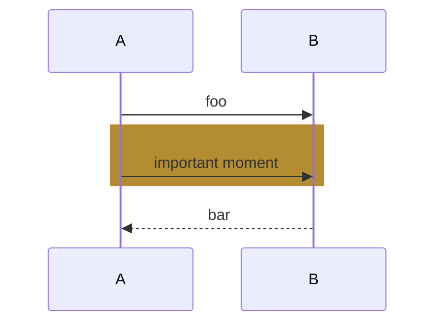
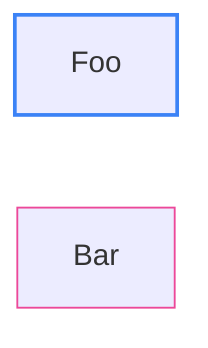
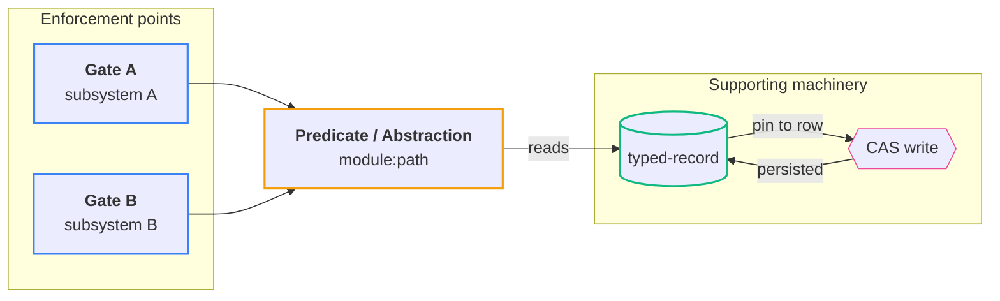
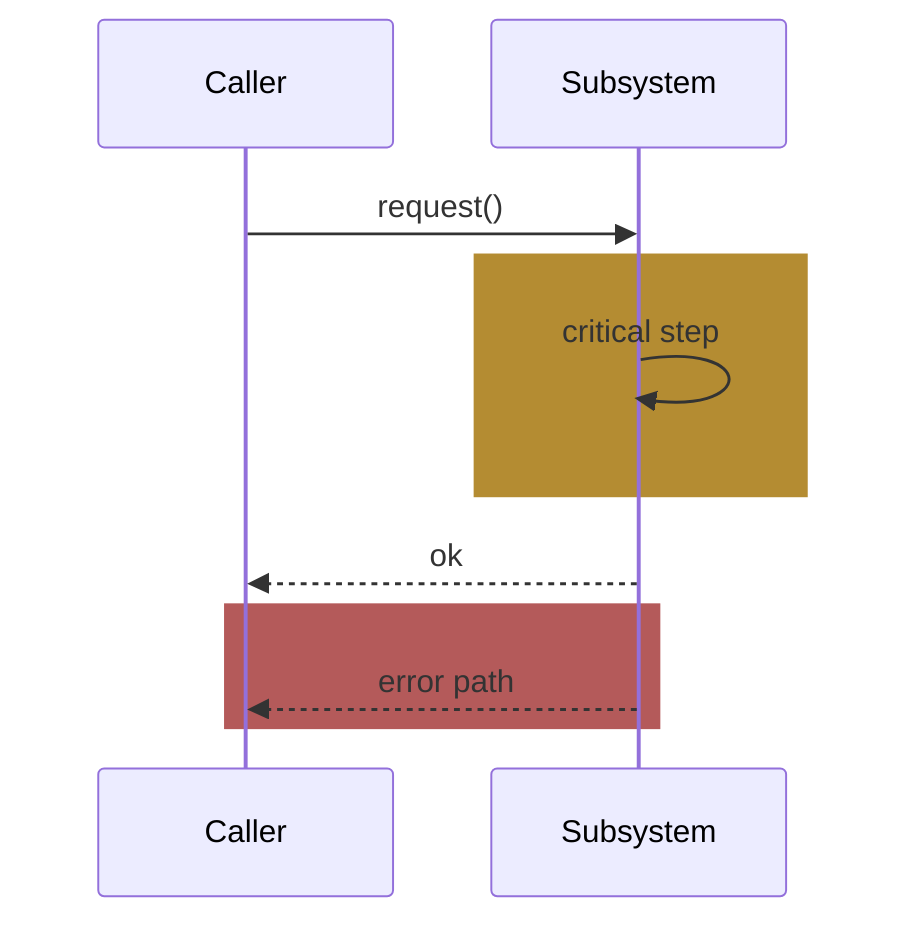

# Diagrams — Mermaid conventions for tours

Reference for Phase 2 (Draft) of the `gzreview` skill. Read before rendering. Every rule below has cost a Plannotator round.

## Why Mermaid, not D2 (and not external SVGs)

A tour markdown is read in many places — Plannotator, GitHub, VS Code preview, Cursor, an internal wiki. They all render Mermaid inline if it's in a ` ```mermaid ` fence. They do not all render D2. They do not all resolve relative `` paths to sibling SVGs.

Tradeoff: D2's standalone SVG renders look noticeably more polished. But polished diagrams that don't show up are worth less than ASCII-art that does. This skill picks the portable format.

If you must use D2 (e.g. you have a directed-graph-with-clusters that Mermaid can't lay out), render it to SVG, place the SVG next to the markdown, and embed via a relative `` — but accept that some viewers will show a broken image.

## Three diagrams typically earn their place

Don't aim for three. Aim for the ones that *change the reader's understanding*. A tour with zero diagrams and great prose is better than a tour with three filler diagrams.

1. **Architecture overview** — `flowchart LR`. Shows the new abstractions / changed shape and how they relate. Goes right after the type-specific body's main section (the abstractions, the fix, the shape-after, etc.) and before the *Where it's used* section when one exists.
2. **Primary flow** — `sequenceDiagram`. Shows the happy-path / fix-path / new-code-path interaction across the change. Goes inside the section it explains (a *Where it's used* subsection for feature branches, the *The fix* section for bug-fix branches, the *What changed* section for perf branches).
3. **Lifecycle / write-path** — `sequenceDiagram`. Shows how the abstraction is persisted, invalidated, and kept honest. Goes in the cross-cutting section.

Skip any that doesn't show something the prose can't.

## Theme safety — the rules

A tour is read in both light and dark themes. Plannotator's UI is dark; GitHub's preview can be either; users' VS Code is whatever they set it to. The diagram must render legibly in both. Mermaid does most of this work, but two things can break it:

### Rule 1 — Use mid-tone values for `rect rgb(...)` highlights

Sequence diagrams support inline rect highlights:



The rect *fill* is hard-coded by your hex; the *text inside* uses the theme's foreground color (black on light, white on dark). Therefore:

- Light pastel fills (e.g. `rgb(254, 243, 199)`) work on light theme (dark text on light yellow) but fail on dark (white text on light yellow → invisible).
- Dark fills (e.g. `rgb(120, 90, 20)`) work on dark theme (white text on dark amber) but fail on light (black text on dark amber → invisible).

Mid-tones around L*≈45–55 work in both directions. Specific values that have survived review:

- **Amber / warning / informational highlight:** `rect rgb(180, 140, 50)`
- **Red / error / failure-path highlight:** `rect rgb(180, 90, 90)`
- **Green / success highlight (rare):** `rect rgb(80, 140, 80)`

If you need additional colors, hand-pick values in HSL: hue you want, saturation around 50%, lightness around 45–50%. Then test in both themes before committing.

### Rule 2 — Strokes only on `classDef`; let the theme own fills

In a flowchart, classDefs are how you visually group node categories. Set **only `stroke:` and `stroke-width:`**:



This way the theme controls the fill and text color; your stroke provides categorical differentiation in both themes. If you set `fill:` you override the theme and you're back to fighting it.

### Rule 3 — Subgraph titles must fit on one line

Mermaid's dark theme has a rendering bug where wrapped subgraph titles render the second line at near-zero opacity behind the subgraph border. The fix is to shorten the title so it doesn't wrap. There is no `max-width` knob in Mermaid you can set; you fix it by writing a shorter title.

Practical rule: subgraph titles should be **≤ 25 characters**. Examples:

- ❌ `subgraph G["Three independent enforcement points"]`
- ✅ `subgraph G["Enforcement points"]`
- ❌ `subgraph V["Validation machinery and its CAS write path"]`
- ✅ `subgraph V["Validation machinery"]`

## Visual verification — required, not optional

Do not paste a Mermaid fence you have not rendered and looked at. Render both themes to SVG, convert to PNG, and `Read` them. Adjust until both look correct, then copy the verified source into the inline fence.

Working directory: `.agents/diagrams/` (scratch — not part of the deliverable).

```bash
# from <repo>/.agents/diagrams/
for f in 01-architecture 02-primary-flow 03-lifecycle; do
  bunx @mermaid-js/mermaid-cli -i $f.mmd -o $f.light.svg -b transparent -t default
  bunx @mermaid-js/mermaid-cli -i $f.mmd -o $f.dark.svg  -b transparent -t dark
  qlmanage -t -s 1600 -o . $f.light.svg
  qlmanage -t -s 1600 -o . $f.dark.svg
done
```

Then `Read` each `<f>.light.svg.png` and `<f>.dark.svg.png` and confirm:

- All labels are legible (no white text on light fills; no black text on dark fills).
- Subgraph titles fit on one line.
- Arrows go to the right nodes (Mermaid sometimes reroutes them after a layout change).
- Rect highlights cover the right span of arrows.

If any rendering looks wrong, edit the `.mmd` and re-render before touching the markdown.

## Common diagrams — starter templates

### Architecture overview (flowchart)



### Sequence diagram with mid-tone highlights



## Anti-patterns

- **`<picture>` tags with `srcset` for theme switching.** Conceptually clean, fails in practice — most markdown viewers either strip raw HTML or don't honor `prefers-color-scheme` inside markdown previews. Inline mermaid + mid-tone colors is the working alternative.
- **External SVGs via `` or `` with relative paths.** Resolution depends on the viewer's serving model; Plannotator and several others don't reach sibling files from the markdown's directory. Don't rely on it.
- **Hand-tuned dark-only or light-only color palettes.** You will be asked to support both. Plan for both up front.
- **Diagrams pasted without rendering.** Mermaid is unforgiving about syntax; one stray bracket and the whole block fails to render. Always render before embedding.
