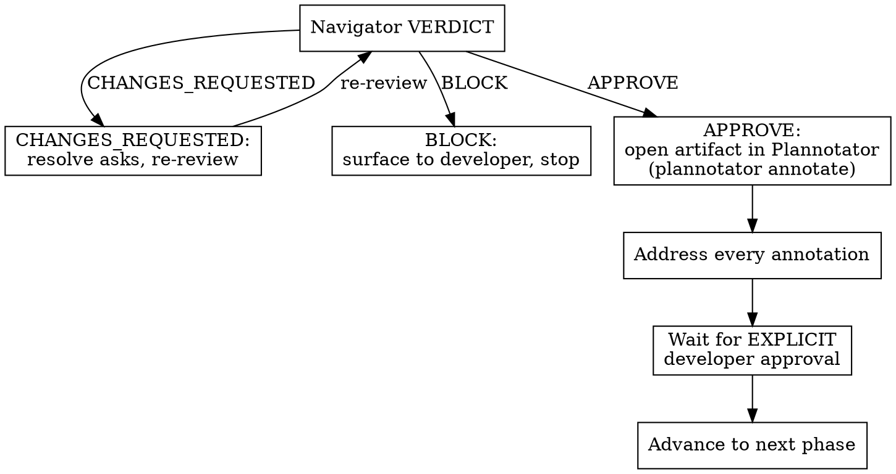

Carry one feature from a BDD scenario, through architecture and design, into a staged TDD implementation on a feature branch. Outside-in: behavior first, architecture second, code last.

## Prerequisites

- The `critique-loop` skill is installed — it is the review engine for every gate.
- The `plannotator` CLI is installed and runnable (`plannotator --help`) — it runs the developer-review gates.
- The working directory is a git repository on a feature branch (not `main`/`master`).
- `d2` is optional; see **D2 handling** for the fallback when it is absent.

## Core principle

**Every phase produces exactly one artifact, and no phase advances until both the navigator (cross-model review) and the developer have approved that artifact.**

Violating the letter of a gate is violating the spirit of the process — a navigator APPROVE is never a substitute for developer approval. They are two separate, both-required gates.

## The 8 phases

### Phase 0 — Frame & track
Derive a kebab-case `<slug>` from the request. Create `docs/features/<slug>/`. Confirm the working directory is a git repo on a feature branch (not `main`/`master`). Create a Task/Todo list with one entry per phase **and per gate** — the developer watches this list.

### Phase 1 — Discovery & Scenarios (BDD)
**REQUIRED BACKGROUND:** `references/scenarios.md` — read before writing scenarios.

Dispatch parallel `Explore` subagents to survey where the feature lands and what it touches. Before drafting any scenario, grep prior PRDs for canonical domain terms (`grep -l "^## Domain Terms" docs/features/*/prd.md`) and reuse them — see `references/scenarios.md` § *Before you write*. Synthesize the survey. Write `docs/features/<slug>/scenarios.md` — declarative `Given/When/Then`, ubiquitous language, one observable behavior per scenario, plus a "How it lands in the product" section.

### Phase 2 — PRD Synthesis
**REQUIRED BACKGROUND:** `references/prd.md` — read before writing the PRD.

Synthesize the conversation, the survey, and `scenarios.md` into `docs/features/<slug>/prd.md`. Do **not** re-interview the developer in this phase; surface gaps as Open Questions for the gate.

The PRD must include **all** of these required sections (see `references/prd.md` for format detail):

- **`## Stakeholders Consulted`** — one line per voice that actually shaped this PRD. *"Primary developer (solo)"* is a valid entry; the rule is honesty, not breadth.
- **`## Quality Targets`** — numeric NFRs (latency p95, RPS, data volume, availability %, durability class), tied to scenarios where applicable. Adjectives like "fast" or "scalable" without numbers are rejected at the gate.
- **`## Constraints`** — explicit rails the design must respect (stack, deadline, regulatory, budget, team).
- **`## Domain Terms`** — canonical vocabulary for every domain concept the feature touches, with rejected aliases under `_Avoid_:`. If deliberately redefining a term from a prior PRD, list it in **`## Aliased Terms`** with the prior PRD's path.

Each User Story is tagged with the scenarios in `scenarios.md` that verify it.

### Phase 3 — Product Review Gate (two approvals)
**REQUIRED SUB-SKILL:** `critique-loop` (review-only flow).

Reviews `scenarios.md` and `prd.md` together — they are one product framing, gated as one.

1. **Navigator review** — run `critique-loop`'s review-only flow against both files with slug `<slug>-product` (see **Calling critique-loop**). Resolve code/scope asks directly; surface product asks to the developer.
2. **Developer review** — run `plannotator annotate docs/features/<slug>/scenarios.md` and `plannotator annotate docs/features/<slug>/prd.md`. Address **every** returned annotation on each. An inline chat message is not this gate.
3. Advance to Phase 4 only after both an APPROVE verdict and **explicit** developer approval on both files.

### Phase 4 — Architecture & Design
**REQUIRED BACKGROUND:** `references/architecture.md` — read before surveying, diagramming, or considering ADRs.

Dispatch parallel subagents to survey the existing architecture, and skim any existing entries in `docs/adr/` that touch this area. Draft the architecture diagram in **both D2 and Mermaid**, render each, **look at both renders and keep whichever reads more clearly** (never embed a diagram you have not looked at) — see `references/architecture.md`. Embed the chosen diagram in `design.md`: a ` ```mermaid ` block (GitHub renders it inline) or the rendered D2 SVGs.

Write `docs/features/<slug>/design.md`. It must include **all** of these required sections (see `references/architecture.md` § *The design document* for format detail):

- **`## System Analysis`** — the as-is: modules in the path, key flow as-is, current load vs. PRD Quality Targets, prior art.
- **`## Components & interfaces`** + **`## Data flow`** — the to-be.
- **`## Integration & Data Ownership`** — per cross-module call: sync REST / async event / streaming / shared DB and *why*; per entity: owner, projections, consistency model.
- **`## Alternatives considered`** (incl. "do nothing") and **`## Tradeoffs`**.
- **`## Risks`** — table linking each risk to the scenario it threatens, the Quality Target it hits, and a mitigation (or an explicit *accept-as-is*).

The implementation slice breakdown does **not** live here — it is the Phase 6 deliverable (`plan.md`). The design feeds the plan; the plan does not feed back into the design.

For any decision that meets **all three** ADR criteria — hard-to-reverse, surprising-without-context, the result of a real trade-off — write a new entry under `docs/adr/NNNN-<slug>.md` (sequential numbering; lazily create `docs/adr/` if missing). Most design decisions do not warrant an ADR; offer one only when all three are true. The tight 1–3-sentence template is the default; add the optional **Revisit conditions** section when the trigger to reopen the decision is nameable. See `references/architecture.md` § *Architecture Decision Records*. ADRs are committed alongside `design.md` in the same `docs:` commit.

### Phase 5 — Design Review Gate (two approvals)
Same shape as Phase 3:
1. **Navigator review** — `critique-loop` review-only flow on `design.md` (and any new ADRs) with slug `<slug>-design` (see **Calling critique-loop**). Resolve code/scope asks directly; surface architecture and product tradeoffs to the developer.
2. **Developer review** — `plannotator annotate docs/features/<slug>/design.md`; address every annotation.
3. Advance to Phase 6 only after both an APPROVE verdict and explicit developer approval.

### Phase 6 — Plan Synthesis
**REQUIRED BACKGROUND:** `references/plan.md` — read before decomposing into slices.

Decompose the approved `design.md` into **vertical-slice tracer bullets** and write `docs/features/<slug>/plan.md`. Each slice cuts every layer the feature touches (schema → API → logic → UI → tests) and is independently demoable. Per slice: title, AFK/HITL tag, blocked-by, stories covered (from `prd.md`), risks addressed (from `design.md` § Risks), behavioral description, and acceptance criteria as a checklist. The **first slice is the tracer bullet** — the thinnest end-to-end path that proves the system wires up. Subsequent slices thicken behavior along that path.

Horizontal slicing — "all schema first, then all API, then all UI" — is explicitly forbidden; see `references/plan.md` for the rationale.

### Phase 7 — Plan Review Gate (two approvals)
Same shape as Phase 5:
1. **Navigator review** — `critique-loop` review-only flow on `plan.md` with slug `<slug>-plan` (see **Calling critique-loop**). Resolve code/scope asks directly; surface ordering and HITL-resolution asks to the developer.
2. **Developer review** — `plannotator annotate docs/features/<slug>/plan.md`; address every annotation.
3. Advance to Phase 8 only after both an APPROVE verdict and explicit developer approval.

### Phase 8 — Staged Implementation
**REQUIRED BACKGROUND:** `references/implementation.md` — read before the first slice.

For each slice in `plan.md`, run the double-loop TDD cycle:
1. **Tests first** — acceptance test (outer loop, RED) anchored to the slice's acceptance criteria, then unit tests (inner loop, RED).
2. **Code** — minimal code to green, then refactor.
3. **Review** — `critique-loop` review-only flow on the slice diff with slug `<slug>-slice-N`; resolve asks. This is a navigator-only review, **not** a phase gate — it has no Plannotator developer-review leg.
4. **Proceed** — tick the slice's acceptance-criteria boxes in `plan.md`, mark the task done, move on.

After the final slice, run one `critique-loop` review of the whole feature diff with slug `<slug>-final`. Handle its verdict exactly as the flowchart dictates — resolve `CHANGES_REQUESTED`, surface `BLOCK`. On APPROVE, produce a summary report: the feature branch is then ready for the developer to open a PR or merge. Opening and merging the PR is out of scope — see `babysit-pr`.

## Gate-decision flowchart

After any navigator verdict, do not advance on your own judgement — follow this:



The APPROVE path never goes straight to "advance" — it always passes through Plannotator and explicit developer approval first.

## Rationalization table

| Excuse | Reality |
|---|---|
| "The navigator already signed off." | Navigator review and developer approval are two separate, both-required gates. One does not satisfy the other. |
| "We're behind schedule — don't wait." | Gates are how you stay fast. The developer gate is the cheaper half; skipping it risks a full rework loop later. It is NOT an invented extra review cycle — it is part of the defined process. |
| "The code is already worked out in my head." | Tests-first defines what the code *should* do; writing code first lets tests describe what it *does*. Write the tests first. |
| "It's the same file — might as well do slice 4 now." | Scope is fixed by the approved plan. Note the observation, defer it, stay scoped to the current slice. |
| "I'll just confirm the artifact in chat." | The developer-review gate runs through `plannotator annotate` on the artifact. An inline chat message is not the gate. |

## Red flags — STOP

If you catch yourself thinking any of these, a gate is about to be skipped:

- "The navigator signed off, so I can advance." → STOP. Open the artifact in Plannotator and wait for explicit developer approval.
- "I'll add tests after the code." → STOP. Write the failing tests first.
- "While I'm in here I'll also…" → STOP. Note it, defer it, stay scoped to the current slice.
- "I'll just confirm in chat." → STOP. Run `plannotator annotate` on the artifact.
- "Don't wait on anything else." → STOP. The developer gate is part of the process, not a delay.

## Artifacts & commits

```
docs/features/<slug>/
  scenarios.md                      # Phase 1
  prd.md                            # Phase 2 — Stakeholders, Quality Targets, Constraints, Domain Terms (+ Aliased Terms when redefining)
  design.md                         # Phase 4 — System Analysis, Components, Integration & Data Ownership, Risks
  plan.md                           # Phase 6 — vertical-slice tracer bullets with AFK/HITL, acceptance criteria
  diagrams/architecture.d2          # current + proposed states in one file
  diagrams/architecture-current.svg
  diagrams/architecture-proposed.svg

docs/adr/                           # Phase 4 — lazily created when the first ADR is needed
  NNNN-<slug>.md                    # sequentially numbered
```

Commit artifacts with `docs:` conventional commits. ADRs created in Phase 4 are committed together with `design.md` in the same commit. `critique-loop`'s `.critique-loop/` scratch stays gitignored.

## Calling critique-loop

`gzship` invokes `critique-loop`'s review-only flow several times on one branch. `critique-loop` names its session and artifact files from a slug — by default the branch name. If every call reused the branch name, each review would overwrite the previous one's files. So pass a **distinct slug** to each invocation:

| Call | Slug |
|---|---|
| Phase 3 — product (scenarios + PRD) review | `<slug>-product` |
| Phase 5 — design (and any new ADRs) review | `<slug>-design` |
| Phase 7 — plan review | `<slug>-plan` |
| Phase 8 — slice N review | `<slug>-slice-N` |
| Phase 8 — final whole-diff review | `<slug>-final` |

Each slug gets its own `critique-loop` session, so reviews stay independent and their artifacts do not collide.

## D2 handling

Run `d2 --version`. If present, render each `.d2` to `.svg`. If missing, offer `brew install d2` (or the official install script). If the developer declines, commit the `.d2` source only and embed it as a fenced code block in `design.md`.

## Escalation

If `plan.md` has **5 or more slices**, dispatch each slice to its own fresh subagent in Phase 8 to keep the main context lean.
