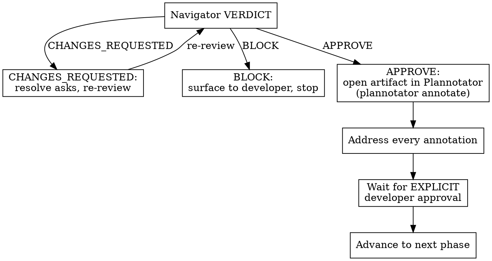

Carry one feature from a BDD scenario, through architecture and design, into a staged TDD implementation on a feature branch. Outside-in: behavior first, architecture second, code last.

## Prerequisites

- The `critique-loop` skill is installed — it is the review engine for every gate.
- The `plannotator` CLI is installed and runnable (`plannotator --help`) — it runs the developer-review gates.
- The working directory is a git repository on a feature branch (not `main`/`master`).
- `d2` is optional; see **D2 handling** for the fallback when it is absent.

## Core principle

**Every phase produces exactly one artifact, and no phase advances until both the navigator (cross-model review) and the developer have approved that artifact.**

Violating the letter of a gate is violating the spirit of the process — a navigator APPROVE is never a substitute for developer approval. They are two separate, both-required gates.

## The 5 phases

### Phase 0 — Frame & track
Derive a kebab-case `<slug>` from the request. Create `docs/features/<slug>/`. Confirm the working directory is a git repo on a feature branch (not `main`/`master`). Create a Task/Todo list with one entry per phase **and per gate** — the developer watches this list.

### Phase 1 — Discovery & Scenario (BDD)
**REQUIRED BACKGROUND:** `references/scenarios.md` — read before writing scenarios.

Dispatch parallel `Explore` subagents to survey where the feature lands and what it touches. Synthesize. Write `docs/features/<slug>/scenarios.md` — declarative `Given/When/Then`, ubiquitous language, one observable behavior per scenario, plus a "How it lands in the product" section.

### Phase 2 — Scenario Review Gate (two approvals)
**REQUIRED SUB-SKILL:** `critique-loop` (review-only flow).

1. **Navigator review** — run `critique-loop`'s review-only flow against `scenarios.md`. Resolve code/scope asks directly; surface product asks to the developer.
2. **Developer review** — run `plannotator annotate docs/features/<slug>/scenarios.md`. Address **every** returned annotation. An inline chat message is not this gate.
3. Advance to Phase 3 only after both an APPROVE verdict and **explicit** developer approval.

### Phase 3 — Architecture & Design
**REQUIRED BACKGROUND:** `references/architecture.md` — read before surveying or diagramming.

Dispatch parallel subagents to survey the existing architecture. Produce one `diagrams/architecture.d2` holding both the current and proposed states (see `references/architecture.md` for the D2 syntax). Write `docs/features/<slug>/design.md`: components, interfaces, data flow, error handling, tradeoffs, and the **implementation stage breakdown**.

### Phase 4 — Design Review Gate (two approvals)
Same shape as Phase 2:
1. **Navigator review** — `critique-loop` review-only flow on `design.md`. Resolve code/scope asks directly; surface architecture and product tradeoffs to the developer.
2. **Developer review** — `plannotator annotate docs/features/<slug>/design.md`; address every annotation.
3. Advance to Phase 5 only after both an APPROVE verdict and explicit developer approval.

### Phase 5 — Staged Implementation
**REQUIRED BACKGROUND:** `references/implementation.md` — read before the first stage.

For each stage in the design's breakdown, run the double-loop TDD cycle:
1. **Tests first** — acceptance test (outer loop, RED), then unit tests (inner loop, RED).
2. **Code** — minimal code to green, then refactor.
3. **Review** — `critique-loop` review-only flow on the stage diff; resolve asks.
4. **Proceed** — mark the stage's task done, move on.

After the final stage, run one `critique-loop` review of the whole feature diff. Handle its verdict exactly as the flowchart dictates — resolve `CHANGES_REQUESTED`, surface `BLOCK`. On APPROVE, produce a summary report: the feature branch is then ready for the developer to open a PR or merge. Opening and merging the PR is out of scope — see `babysit-pr`.

## Gate-decision flowchart

After any navigator verdict, do not advance on your own judgement — follow this:



The APPROVE path never goes straight to "advance" — it always passes through Plannotator and explicit developer approval first.

## Rationalization table

| Excuse | Reality |
|---|---|
| "The navigator already signed off." | Navigator review and developer approval are two separate, both-required gates. One does not satisfy the other. |
| "We're behind schedule — don't wait." | Gates are how you stay fast. The developer gate is the cheaper half; skipping it risks a full rework loop later. It is NOT an invented extra review cycle — it is part of the defined process. |
| "The code is already worked out in my head." | Tests-first defines what the code *should* do; writing code first lets tests describe what it *does*. Write the tests first. |
| "It's the same file — might as well do stage 4 now." | Scope is fixed by the approved design. Note the observation, defer it, stay scoped to the current stage. |
| "I'll just confirm the artifact in chat." | The developer-review gate runs through `plannotator annotate` on the artifact. An inline chat message is not the gate. |

## Red flags — STOP

If you catch yourself thinking any of these, a gate is about to be skipped:

- "The navigator signed off, so I can advance." → STOP. Open the artifact in Plannotator and wait for explicit developer approval.
- "I'll add tests after the code." → STOP. Write the failing tests first.
- "While I'm in here I'll also…" → STOP. Note it, defer it, stay scoped to the current stage.
- "I'll just confirm in chat." → STOP. Run `plannotator annotate` on the artifact.
- "Don't wait on anything else." → STOP. The developer gate is part of the process, not a delay.

## Artifacts & commits

```
docs/features/<slug>/
  scenarios.md
  design.md
  diagrams/architecture.d2          # current + proposed states in one file
  diagrams/architecture-current.svg
  diagrams/architecture-proposed.svg
```

Commit artifacts with `docs:` conventional commits. `critique-loop`'s `.critique-loop/` scratch stays gitignored.

## D2 handling

Run `d2 --version`. If present, render each `.d2` to `.svg`. If missing, offer `brew install d2` (or the official install script). If the developer declines, commit the `.d2` source only and embed it as a fenced code block in `design.md`.

## Escalation

If the design's stage breakdown has **5 or more stages**, dispatch each stage to its own fresh subagent to keep the main context lean.
